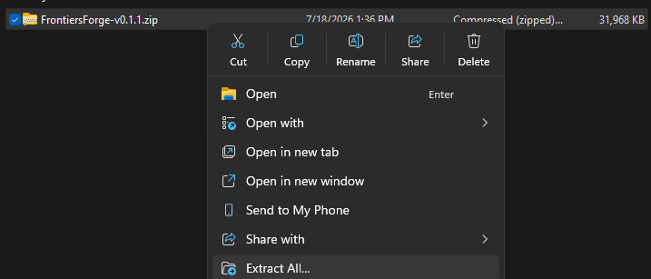
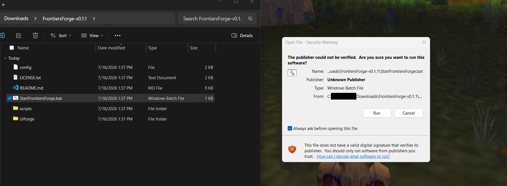
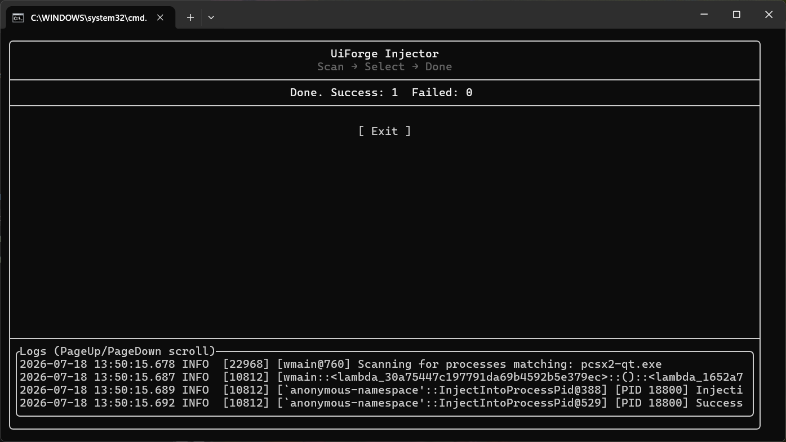
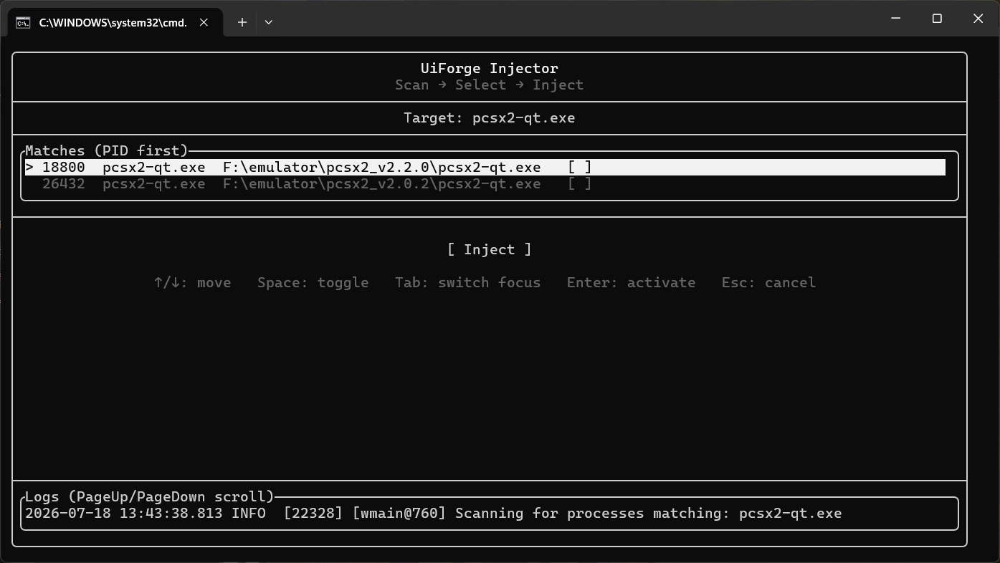
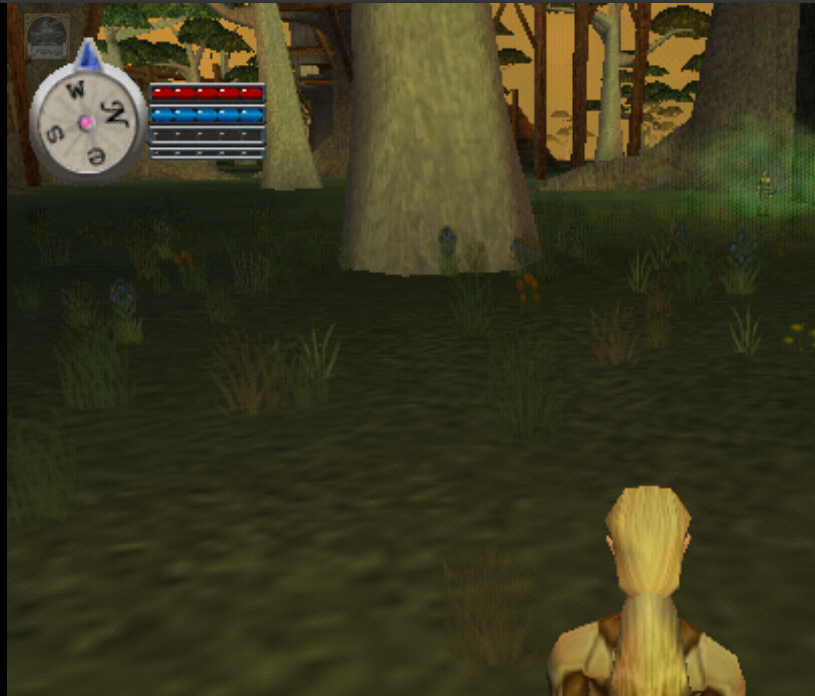

<h1 align="center">FrontiersForge</h1>
<p align="center">
  <a href="https://github.com/mmvest/FrontiersForge/blob/main/LICENSE.txt">
    
  </a>
  <br>
  A framework for managing custom UI elements and accessing game data from EverQuest Online Adventures Frontiers (EQOA) on the PCSX2 emulator.
</p>

## Overview

FrontiersForge is a Lua-based API designed to help developers create custom UI addons and access game data from EverQuest Online Adventures Frontiers as run on the [Sandstorm Server](https://eqoa.live/) using the [PCSX2 emulator](https://pcsx2.net/). This project piggybacks off the [UiForge](https://github.com/mmvest/User-Interface-Forge) project, providing an easy way to interact with the game's internal structures and display that data via custom UI elements using [ImGui](https://github.com/ocornut/imgui).

### Note: This is in a "beta" state. You may anticipate the API to stay mostly consistent at this point, but until it is fully released, some aspects of the API may shift. Expect potentially breaking changes to any mods created using these modules.

### ⚠️ **WARNING**:
Use this code at your own risk. UiForge injects code into the PCSX2 emulator and grants access to the game's memory. Only place trusted scripts in the `scripts` and `scripts/modules` directory. Also note that Windows Defender may flag UiForge.exe as malware. It is not. Go visit the UiForge repo to read the code.

## Requirements

- **[PCSX2](https://pcsx2.net/)**: Tested on 64-bit versions of PCSX2 v1.7.3727, v2.0.2, and v2.2.0, running on Windows 11. Other versions may work, but they haven't been tested.
- **DirectX 11/12**: Currently UiForge only supports DirectX 11 and 12, so be sure PCSX2 is using one of those for rendering.
- **Windows OS**: This definitely works on Windows 11 64-bit. I imagine it would also work on Windows 10 and maybe Windows 7.
- **EQOA: Frontiers (US Version)**: This has only been tested on the US version of EverQuest Online Adventures: Frontiers.

## Getting Started

**If you are here just to download the mods and play, this is the section for you.**

If you are wanting to download the code base so you can build manually and such, see the [Setup and Running](#setup-and-running) section below.

To use FrontiersForge, first visit the [Releases page](https://github.com/mmvest/FrontiersForge/releases) to download a zip containing whatever release you would like to use.

After downloading, extract the contents of the zip.


After that, be sure pcsx2 is running and that EQOA is on. At that point, go ahead and double click the `StartFrontiersForge.bat` file. A window may pop up asking if you trust this script to run. Click Run.
 

> **NOTE: You may need to run the script as an administrator or even run it directly through an admin command prompt window to get FF to start properly depending on how your machine is setup.**

At that point you will see one of the following screens.

If you are injecting into a single instance of pcsx2, it automatically inject into pcsx2 and will look like this:


If you are injecting into 2 or more instances of pcsx2, it will look like this and you will need to select the processes to inject FrontiersForge into. The keybinds to do so are displayed under the `[ Inject ]` button.


If the injection is successful, you will see the UiForge icon appear, generally in the top left corner.


Click on this to open the UiForge window where you can enable/disable mods, manage settings, save profiles of mods you like to have active, etc.

If you wish to add more mods, download them from the community and drop them into your scripts directory.

If you have any questions, please consult the [FAQ](#faq)!

Happy modding!


## Setup and Running

1. Clone the repository:
    ```bash
    git clone --recurse-submodules https://github.com/mmvest/FrontiersForge.git
    cd FrontiersForge
    ```

   If you already cloned without submodules, run:
   ```bash
   git submodule update --init --recursive
   ```

   Note: UiForge is included as a git submodule and built binaries (like `uiforge_core.dll`) are no longer distributed directly with the repo. Use the release zip files or build locally.

1. Make sure you have **PCSX2 v1.7.3727** or greater and **EQOA: Frontiers (US Version) ISO**.
1. Place your UI Lua scripts (dubbed ForgeScripts by the UiForge Project) in the `scripts` directory.
1. Run `pcsx2-qt.exe`, start EQOA, and then execute `StartFrontiersForge.bat`.

Once started, the UiForge settings icon should appear in the top-left corner. Click on it to see the UiForge menu. Click the settings icon again to close the UiForge menu.

To detach UiForge from the process and clean it up, press `Ctrl+Shift+Alt+End` (PCSX2 must be the focused window for the eject hotkey to work).

To enable a script, click the checkbox next to it. Scripts that create Lua Errors are disabled automatically.

To see script settings or debug stats, click on the script name. If it has any settings, the settings will appear in the settings tab. Debug stats can be viewed by clicking the debug tab.

For everything else about the host framework (script packages, callbacks, profiles, the config file, logging, and the `UiForge` Lua API for textures, fonts, and audio), see the [UiForge documentation](https://github.com/mmvest/User-Interface-Forge).

## Building (from source)

`BuildFrontiersForge.bat` builds the UiForge submodule and then updates this repo's `scripts/` by copying the latest scripts from `UiForge/scripts` into `scripts/` (overwriting old versions).

1. Ensure you can build UiForge (see the [UiForge repo](https://github.com/mmvest/User-Interface-Forge) for the requirements).
1. Run:
   ```bat
   BuildFrontiersForge.bat
   ```

To create a release zip:
```bat
BuildFrontiersForge.bat -zip -version 1.2.3
```

This writes `releases/FrontiersForge-v1.2.3.zip`.

## Included mods

| Mod | Description |
|--------|-------------|
| [`ff_example`](scripts/ff_example.lua) | For mod makers, a living demo of nearly everything FrontiersForge can do. Start here to see how the API is used. |
| [`mini_map`](scripts/mini_map/mini_map.lua) | A minimap that draws the world around you, including caves and dungeons. Zoom in and out, rotate with your character, track creatures, and more. |
| [`world_map`](scripts/world_map/world_map.lua) | A full map of Tunaria showing where you are and which way you are facing. Search for creatures by name or level, see where they live on the map, and track one to have the minimap guide you to it. Fills a personal journal with every creature you meet as you play, which you can share with friends. |
| [`wereoxxs_ui`](scripts/wereoxxs_ui/wereoxxs_ui.lua) | A modern look for the whole game UI, by Wereoxx (thats me!). Ability bars, casting bar, player and target frames, group frames, a compass, a damage meter, and a better chat window. See its [README](scripts/wereoxxs_ui/README.md). |
| [`avoids_modern_ui_mods`](scripts/avoids_modern_ui_mods.lua) | A pack of modern UI replacements by Avoids: health, mana, and experience bars, ability bar, chat log, group frames, pet frame, quest log, buffs/debuffs, and target level. Turn each one on or off individually. |
| [`retro_health_hearts`](scripts/retro_health_hearts.lua) | Shows your health as a row of retro video game hearts. |

## Modules

The EQOA modules live in `scripts/modules/frontiers_forge` and are loaded with `require("frontiers_forge.<name>")`.

| Module | Description |
|--------|-------------|
| `ability.lua` | Accessors for a single ability record. Name, description, range, cast time, power cost, cooldown state, icon refs, and scope. |
| `ability_bar.lua` | The hotbar. Which ability or item occupies each hotbar slot. |
| `ability_list.lua` | The full ability list from the Abilities menu. Iteration and lookup by id or name. |
| `bank.lua` | Bank contents. |
| `camera.lua` | Camera coordinates and facing (radians and degrees). |
| `chat.lua` | Captures chat messages as they arrive, with message type classification. Can also send chat and slash commands from a mod through the game's own typed-chat path. |
| `combat.lua` | Combat event capture (damage and healing numbers) with attacker/defender ids and pet detection. Useful for damage meters. |
| `effects.lua` | The player's active effects (buffs and debuffs), icon hashes and names. |
| `entity.lua` | Accessors for a single entity. Name, id, level, health percent, position, disposition, distance to a world point, and whether it is an NPC, a player character, or a player's pet. |
| `entity_list.lua` | The 24-slot entity list. Lookup by index, id, or name. Slot 0 is always the player. |
| `gems.lua` | Static gem data table (gem, rarity, type, stat). |
| `group.lua` | Group membership and per-member data. |
| `icon.lua` | Decodes game icon textures straight out of emulated PS2 memory into ImGui textures, cached by resource hash. |
| `input.lua` | Controller input. Button states and raw or normalized analog stick values. Can also hook the keyboard to capture key events and suppress keys from reaching the game. |
| `inventory.lua` | Inventory slots and their item records. |
| `item.lua` | Accessors for a single item record. Name, stats, damage, range, icon refs, and more. |
| `player.lua` | Player data. Name, level, experience, stats, resists, health, power, coordinates, and own, target, and pet entity ids. |
| `quest.lua` | Accessors for a single quest log entry. |
| `quest_log.lua` | The quest log list. Count and lookup by index. |
| `ui.lua` | Toggles built-in HUD elements (ability bar, chat, health bar, etc.) and draws game UI art like disposition icons. |
| `util.lua` | Low-level helpers. EE memory reads and writes, pointer chain resolution, guest pointer validation, string conversion, distance and bearing between world points, compass heading, current world id, file listing, and experience tables. |

Larger script packages carry their own private modules in their `modules` folder. The minimap's renderer lives in [`scripts/mini_map/modules`](scripts/mini_map/modules) (`world_geometry.lua` walks the live scene graph out of EE memory, `surface.lua` decodes the game's textures, `map_render.lua` rasterizes the top-down view), and the world map's search and journal live in [`scripts/world_map/modules`](scripts/world_map/modules).

Two additional module folders are type-hint stubs for your editor, `scripts/modules/imgui/imgui.lua` and `scripts/modules/uiforge/uiforge.lua`. They enable intellisense for the ImGui and UiForge bindings. DO NOT `require` these in your scripts, that will break your Lua environment.

## License

This project is licensed under the MIT License. See the [LICENSE.txt](LICENSE.txt) file for more details.

## Contributing

Contributions are welcome! If you want to help improve the project, open an issue or submit a pull request. Feel free to suggest features or report bugs.

## FAQ

**Injection succeeds but nothing pops up.**
Check your config file and make sure the graphics api setting matches the renderer PCSX2 is actually using (`d3d11` or `d3d12`). Note that `auto` will prioritize d3d12.

**How do I eject?**
Use the eject hotkey `Ctrl+Shift+Alt+End` (PCSX2 must be the focused window), or the eject button in the FrontiersForge menu.

**How can I tell if it is working?**
You will see the UiForge icon appear somewhere on the screen, generally in the top left corner.

**Nothing happens when I run `StartFrontiersForge.bat`.**
Check that the UiForge executable and dll are where they are supposed to be: `UiForge.exe` belongs in the `UiForge` folder, and `uiforge_core.dll` belongs in `UiForge\bin`. You may also need to run the script as administrator.

**Why do the custom UI elements end up in the wrong place or the wrong size when my window or resolution changes?**
Resizing the PCSX2 window, changing resolution, or moving between monitors can make the custom UI look wrong: elements don't scale with the window, don't sit where you left them, or seem to disappear entirely (they are actually just off the edge of the screen). This happens because each element keeps a fixed position and size in screen pixels rather than adapting to the window. The best way to avoid it is to set up your mod layout at the window size and resolution you normally play at, and keep using that same setup each time.
